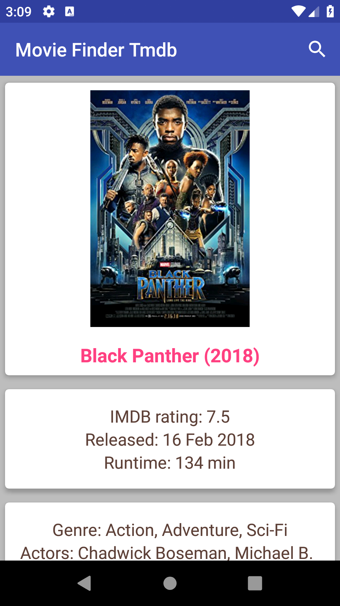
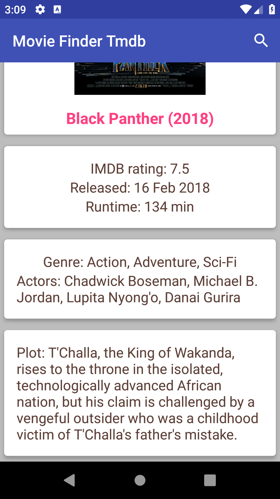

# MovieFinderOmdb
Android App to search movie details and rating quickly using [Omdb API](http://omdbapi.com/)

## Screenshot
 

**Note :** The project consist of two branches one uses Volley library for network call and the other uses Retrofit.
* [Branch 1(master)](https://github.com/Tobibur/MovieFinderOmdb)
* [Branch 2(usingretrofit)](https://github.com/Tobibur/MovieFinderOmdb/tree/usingretrofit)

## Tutorial

Tutorial of this project is found in this blog: 
[link](https://tobiburblog.wordpress.com/2018/04/23/android-movie-finder-app-tutorial/)

## License & Copyright

Licensed under the [MIT License](LICENSE).
